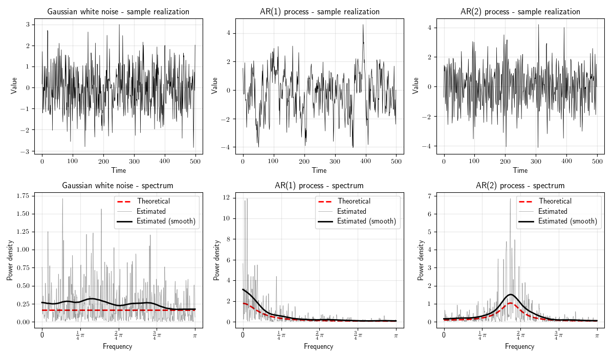

# Python for Time Series Analysis

This repository contains some Python source code I use for my Time Series analyses.
This work comes with no warranty that it works (see the LICENSE file).
The code you will find here must not be expected to be efficient, fast or well written.

If you want to fork and/or contribute to this repository, you're free to do so.
Comments are welcome too!

## Comments

I am going to just drop few lines about the development status of this library I am developing.

* I am soon going to expand the library by adding functions that estimate VAR and VECM models, including a function that performs the Johansen cointegration test.
  Note that there are already two functions that are instrumental for that test.
* Part of this library *heavily* draws from the [Spatial Econometrics Toolbox](http://www.spatial-econometrics.com/) that James LeSage made available to everybody on his webpage.
  In a sense, part of this library can be seen as a port of those Matlab functions to the Python programming language.
  I find his work wonderful and deeply inspiring.
* I am currently working with some Bayesian Econometrics.
  With some time, I will also upload some algorithms that implement Bayesian techniques for time series analysis.
* I am going to write a "proper" landing page (i.e., this README file) sooner or later.
  It is just not my focus at the moment.
* When I will have time, I will upload some material as a wiki, so to drive the casual users that might be approaching my library for the first time.
  For now, I will just suggest readers to look at the (incomplete) docstrings, which explain the general scopes of the functions, along with a description of what are the input parameters.
